# Efficient Harbor Craft Monitoring System: Time-Series Data Analytics and Machine Learning Tools to Achieve Fuel Efficiency by Operational Scoring System
### Features in OMAE2021 Conference, paper number 62658  

The aim is to build a knowledge base (KB) for various activities of a harbor craft.  
The harbor crafts used as subject is a 4,000 BHP ASD tugboat from which a six-month dataset were collected.  
One use of the KB is to monitor hypothetical fuel usage by prediction.  

An activity has a unique signature of parameters (i.e. speed and fuel usage).  
For instance, cruising activity has different parameter measurements versus bollard pulling. 
Both activities may use fuel at same rate, but their travelling speed widely differ. 

To achieve the aim, Unsupervised Machine Learning (Clustering) is used.  
It is in combination with stochastic modelling with Hidden Markov Model.  
Together, they form a set of KB.  
Prediction is carried out with Viterbi Algorithm.  

Authors:  
Dr. Zhi Yung Tay, Januwar Hadi, Dr. Dimitrios Konovessis, De Jin Loh (Singapore Institute of Technology)  
David Tan Kong Hong (PACC Offshore Services)  
Xiao-Bo Chen (Bureau Veritas)  

---

Below is the six-month dataset, cleaned and resampled.  
The entire dataset appear in segments.  
Each segment represent one tugboat job.  

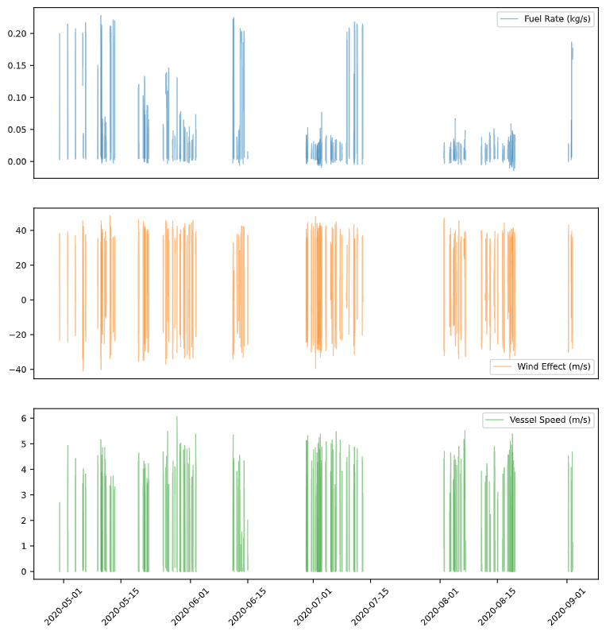

Number of data segments 100.  

Assign one segment as a test segment.  
The test segment is excluded in knowledge base (KB) dataset (for training).  
If total data segments is 100, only 99 is used to generate KB.  
It is for testing the accuracy of KB later.  

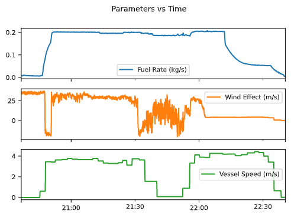

Test segment number: 2  
The data period: 03-May-20 20:36:35 PM to 03-May-20 22:40:30 PM  
The duration: 2 hrs, 55 mins, 2 secs  
Interval: 5 secs  
Number of data points: 1488  

---

## 1. Score Space

As the raw dataset is time-series in nature, it is necessary to convert it to points (the purpose of points is explained later).  
The dimension needs to be reduced from 1 (line/curve) to 0 (point).  

The raw data is cut into uniform subsets.  
The subsets are arranged in parallel, then clustered using time-series clustering.  
The number of time-series clusters is determined by `n_class`.  
The `n_class` determines the score range.  
Each cluster has 1-dimension cluster center.  
Applying simple average generates a point to represent all subsets associated to a particular cluster center.  

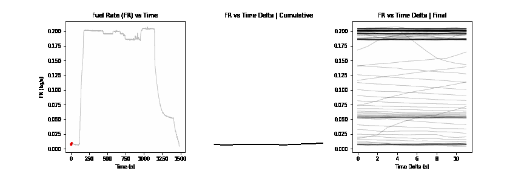

The first three graphs are the raw datapoints, plotted in their own domain (unit dimension).  
Compare with the last graph (right) which allows all parameters to be plotted in the same domain.  

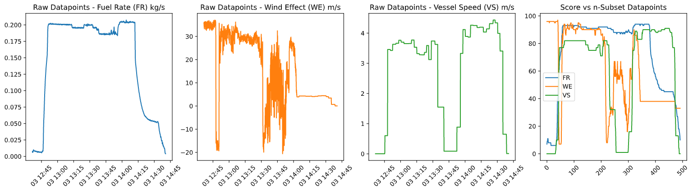

Completing this step enables all parameters to be in the same domain (score).  
Score domain also preserves sequence (time-series) information.  

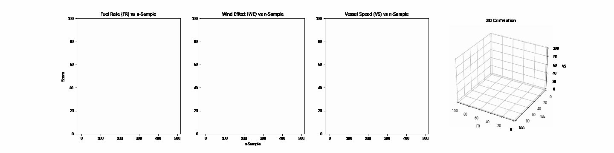

---

## 2. Point Clustering

The sequence information is not used in point clustering.  
Clustering uses K-Means to unsupervisedly create n number of clusters (cluster size).  
All data (except `test_segment`) 3D scatter plot prior to clustering versus after clustering comparison is below.  

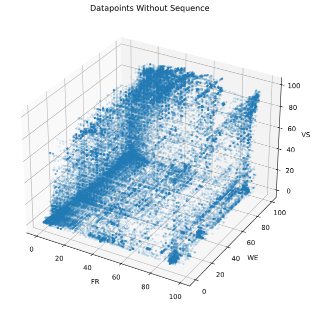    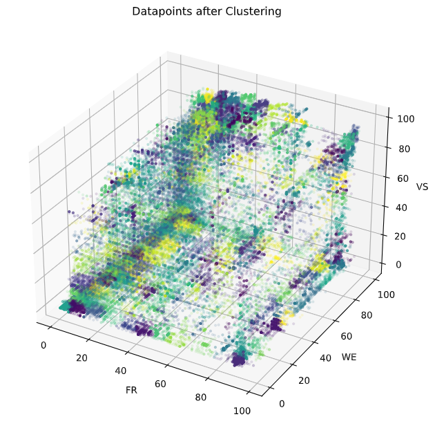

The 3D scatter plot above shows points associated to their clusters/colors (colors may be reused).  

The clusters are accepted once cluster quality value reaches certain value (e.g. ~1).  
If desired cluster quality has not been achieved, repeat or increase cluster size or both.  

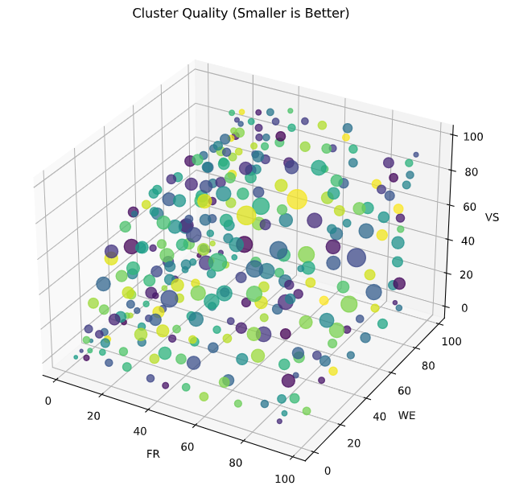

After clustering is done, the sequence information is returned back.  
The graph below (center) shows the `test_segment` passes through different clusters.  
Compare left and right. The right graph has cluster information (in different colors). 

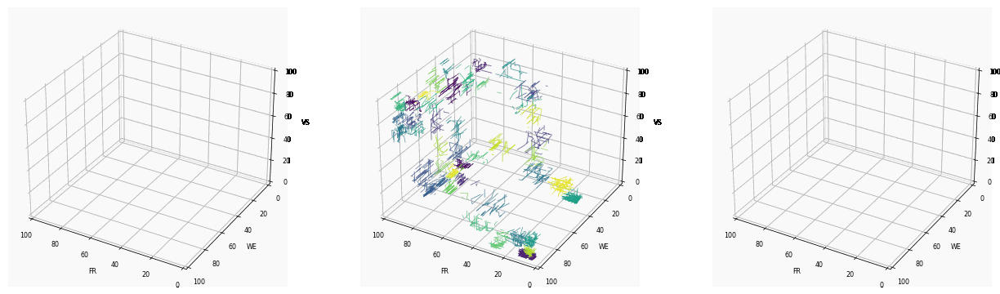

Table showing the sequence of `test_segment` passing through different clusters (CN)

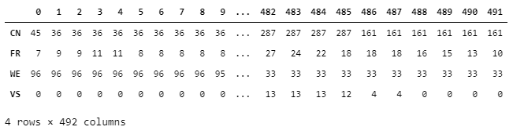

---

## 3. Hidden Markov Model (HMM)

HMM requires one Observable Parameter (OP) and one Hidden Parameter (HP).  
The HP is the fuel rate (FR).  
This demonstration creates two set of HMM.  
In the first set of HMM, wind effect (WE) is the OP.  
The other set uses vessel speed (VS) as the OP.  
OP and HP have their own matrices holding probabilistic information of state (score) association and transition.  

One cluster is selected to demonstrate how HMM matrices are created.  

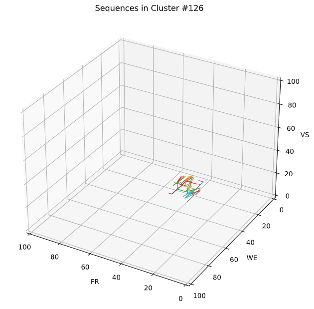

Below is the illustration the creation of KB, the state (score) transition and emission matrices.  
The actual KB is in matrix form.  
The matrices converted to grayscale images to make visualization easy.  

As the sequence transitions from one score state to another, the transition and emission matrices are updated.  
Bright spots are the location where the probability is high.  

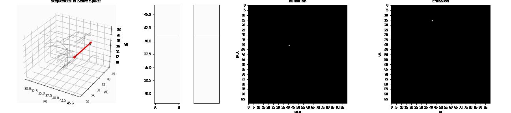

After creation of the model, smoothening filter (e.g. Gaussian Filter) is applied.  
The purpose is to spread the distribution in the model/matrix.  
Distribution spread helps mitigate the truncated sequence information that originally exist between clusters. 

Below shows the before and after smoothening effect comparison for transition matrix.  
Transition matrix contains relationship between HP previous and next HP states in terms of probability.  

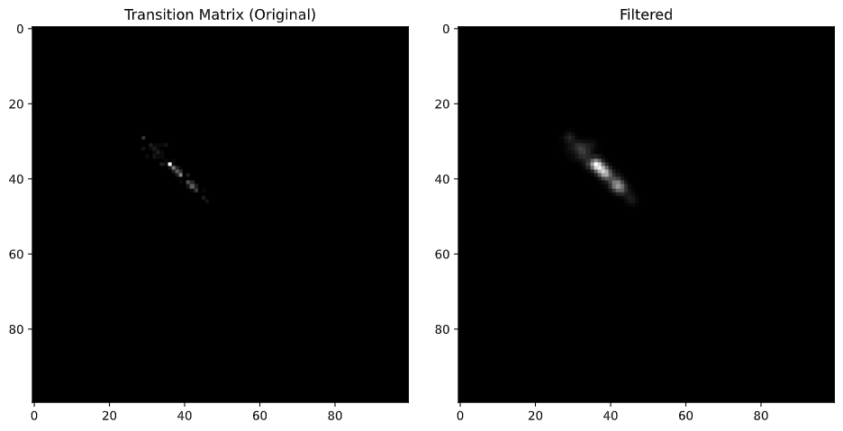

Below shows the before and after comparison for emission matrix.  
Emission matrix contains relationship between observable state (OP) and hidden state (HP).  

Each cluster has one set of matrices: (1) Initial (2) Transition (3) Emission. Initial matrix is now shown here.  
The KB contains likelihood values.  

---

## 4. Prediction

The prediction uses Viterbi Algorithm.  
The prediction uses OP as input to create HP path output.  

Metrics are delta AUC (area under curve) and MSE (mean squared error).  
Delta AUC is the difference of prediction from ground truth in term of percentage (smaller better).  
MSE is the average of squared difference of prediction from ground truth (smaller better). 

The prediction from HMM model that uses WE as OP (top) vs VS as OP (bottom).  

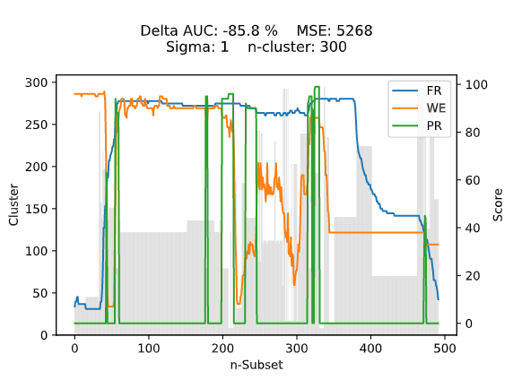   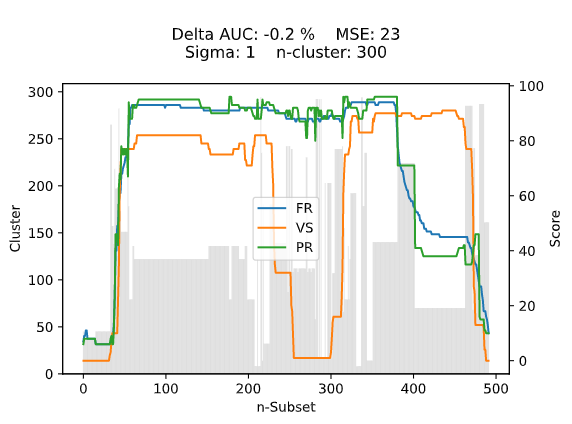

---

## 5. Optional: Error Analysis

Given an error threshold, any cluster associated to an error exceeding the threshold in the `test_segment` can be identified.  
Therefore, it is possible to analyze the cluster shape and size.  

Example below uses 10 as threshold from VS as OP.  

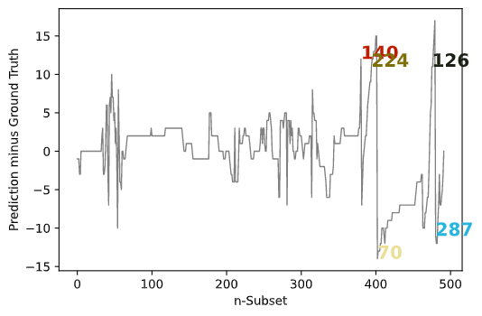

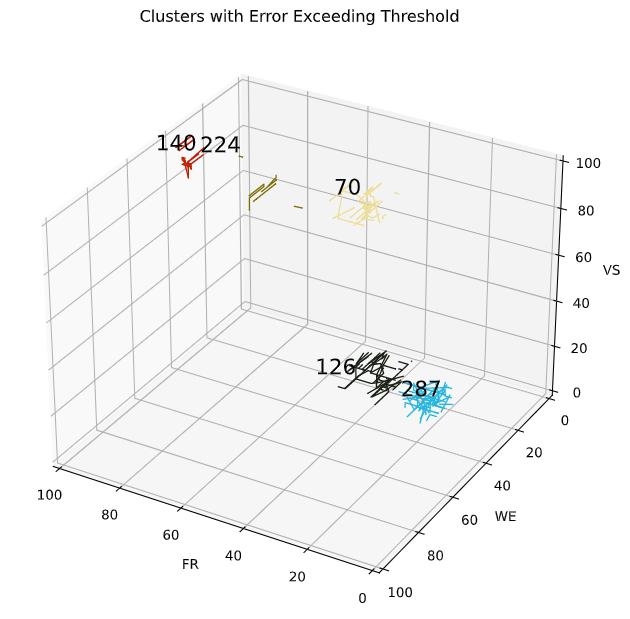

---

## 6. Optional: Revert Score back to Original Unit Dimension

It is possible to convert score back to original unit dimension, as each score is the average time-series cluster center.  

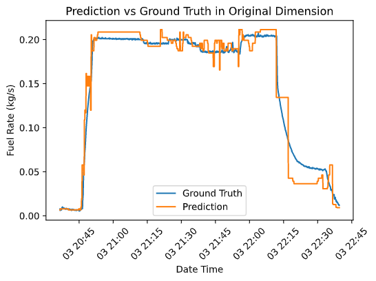

______

### Singapore Institute of Technology (SIT)
